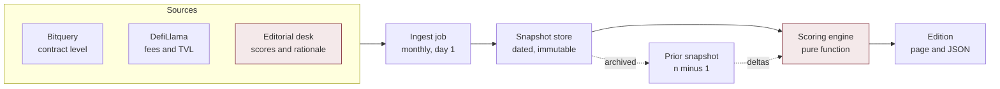

# Fineness Developer Brief

**Version** 1.0
**Date** 21 September 2026
**Status** Approved for build
**Target ship** Edition 02, October 2026

Build specification for **Fineness**, a monthly register that scores tokenized asset venues on what actually backs the token. This document is the single source of truth for v1. Where it conflicts with the published Edition 01 page, **this document wins** and the page is brought into line.

## Contents

1. [Product](#1-product)
2. [Scope of v1](#2-scope-of-v1)
3. [Architecture](#3-architecture)
4. [Scoring engine](#4-scoring-engine)
5. [Data model](#5-data-model)
6. [Sources and provenance](#6-sources-and-provenance)
7. [Admission standard](#7-admission-standard)
8. [Monthly run book](#8-monthly-run-book)
9. [Edition deltas](#9-edition-deltas)
10. [Frontend spec](#10-frontend-spec)
11. [Design tokens](#11-design-tokens)
12. [Editorial integrity](#12-editorial-integrity)
13. [Repository layout](#13-repository-layout)
14. [Seed data, Edition 01](#14-seed-data-edition-01)
15. [Acceptance criteria](#15-acceptance-criteria)
16. [Open questions](#16-open-questions)

***

## 1. Product

Fineness publishes a monthly ranked register of venues that launch or trade tokenized assets. Each venue receives a **fineness score** from 0 to 1000, expressed in parts per thousand on the bullion purity scale, derived from five weighted criteria.

The editorial thesis the product exists to carry: most venues marketed as real world asset platforms launch memecoins, and the real asset appears only as the **pairing asset**. Fineness measures that gap and prices it as purity.

> **Core design constraint**
> The methodology is the product. Every score must be reproducible by a reader from published inputs. If a number cannot be traced to a source or a stated editorial judgement, it does not ship.

***

## 2. Scope of v1

### In scope

* Static edition pages, one per month, permanently addressable
* Client side weight adjustment with live resort, encoded in the URL so a reweighted view is shareable
* Automated ingestion of volume, fee and TVL metrics into a dated snapshot
* Editorial scoring layer with two reviewer sign off
* Month over month fineness and rank deltas from Edition 02 onward
* Machine readable edition JSON served alongside each page

### Out of scope for v1

* Live or streaming price data. Editions are snapshots and must read as snapshots
* Wallet connection, user accounts, notifications
* Any paid placement, sponsorship or promoted listing mechanism. This is a permanent exclusion, not a v1 deferral
* Venue self submission. Admission is editorial, see section 7

***

## 3. Architecture

A build time pipeline. Nothing computes on a server at request time, so a published edition cannot change after freeze except through an explicit corrections process.



Shaded nodes carry editorial judgement. Every other step is deterministic and reproducible from public data. The editorial desk writes only into the `scores` and `rationale` fields. Amendment 2026-09-25: `thesis`, `status` (plus derived `struckDate`), `pairing`, `links` and `facts` also carry forward as judgement, changed only through review; metrics and contracts stay machine-written.

***

## 4. Scoring engine

A pure function. Same inputs, same output, no clock, no network, no randomness. This matters because readers reweight the register in the browser and must arrive at exactly the numbers the build produced.

```ts
// src/scoring/fineness.ts

export const CRITERIA = [
  'asset', 'traction', 'transparency', 'compliance', 'durability'
] as const;

export type Criterion = typeof CRITERIA[number];
export type Scores  = Record<Criterion, number>;
export type Weights = Record<Criterion, number>;

export const HOUSE_WEIGHTS: Weights = {
  asset:        0.30,  // asset quality and verifiability
  traction:     0.25,  // volume, share, fee revenue, pool depth
  transparency: 0.20,  // contracts, locks, docs, named entity
  compliance:   0.15,  // regulatory standing, disclosure
  durability:   0.10,  // age, shock resilience, dependencies
};

export const HALLMARK = 375;

/**
 * Scores are integers 0..10. Weights must sum to 1.
 * Returns fineness in parts per thousand, 0..1000.
 */
export function fineness(scores: Scores, weights: Weights = HOUSE_WEIGHTS): number {
  const total = CRITERIA.reduce((a, c) => a + weights[c], 0);
  if (Math.abs(total - 1) > 1e-9) throw new Error('weights must sum to 1');
  const raw = CRITERIA.reduce((a, c) => a + scores[c] * weights[c], 0);
  return Math.round(raw * 100);
}

export type Band = '22k' | '18k' | '14k' | '9k' | 'below-hallmark';

export function band(f: number): Band {
  if (f >= 916) return '22k';
  if (f >= 750) return '18k';
  if (f >= 585) return '14k';
  if (f >= HALLMARK) return '9k';
  return 'below-hallmark';
}

/** Slider integers 0..10 normalised to weights summing to 1. */
export function normalise(raw: Record<Criterion, number>): Weights {
  const sum = CRITERIA.reduce((a, c) => a + raw[c], 0);
  const out = {} as Weights;
  for (const c of CRITERIA) {
    out[c] = sum === 0 ? 1 / CRITERIA.length : raw[c] / sum;
  }
  return out;
}
```

### Rules

* **Round once**, at the end, to the nearest integer. Never round intermediate criterion products.
* **Ties** in fineness break alphabetically by venue name, so ordering is stable across rebuilds.
* **Zero sum weights** fall back to equal weighting rather than dividing by zero.
* The page displays **normalised** weights as percentages, not raw slider values.

### Band scale

| Fineness | Band | Standard |
|---|---|---|
| 916 and above | `22k` | 22 karat |
| 750 to 915 | `18k` | 18 karat |
| 585 to 749 | `14k` | 14 karat |
| 375 to 584 | `9k` | 9 karat |
| Below 375 | `below-hallmark` | Listed but not certified |

***

## 5. Data model

One record per venue per edition. The edition file is a header plus an array of these.

### Edition header

```jsonc
{
  "edition": "2026-09",
  "published": "2026-09-21",
  "dataAsOf": "2026-09-20",
  "snapshotHash": "sha256:...",
  "houseWeights": { "asset": 0.30, "traction": 0.25, "transparency": 0.20,
                    "compliance": 0.15, "durability": 0.10 },
  "disclosures": [],
  "venues": []
}
```

### Venue record

```jsonc
{
  "id": "long-xyz",                  // stable slug, never reused
  "name": "Long.xyz",
  "chain": "robinhood-chain",
  "resident": true,                  // false marks an off chain competitor
  "status": "active",                // active | prelaunch | paused | struck
  "admittedEdition": "2026-09",

  "thesis": "One sentence. What this venue is and what it is not.",

  "scores": {                        // integers 0..10, editorial
    "asset": 8, "traction": 8, "transparency": 6,
    "compliance": 6, "durability": 7
  },
  "rationale": {                     // one key per criterion, all required
    "asset": "...",
    "traction": "...",
    "transparency": "...",
    "compliance": "...",
    "durability": "..."
  },

  "pairing": {
    "assetType": "tokenized-equity", // none | tokenized-equity | inventory-index
                                     // | collectible | synthetic
    "custodian": "Robinhood Europe",
    "redeemable": false,
    "verifiability": "on-chain"      // on-chain | public-inventory
                                     // | attestation | none
  },

  "metrics": {                       // null is legal, renders as "not published"
    "cumulativeVolumeUsd": 3000000000,
    "dailyVolumeUsd": 151000000,
    "fees24hUsd": null,
    "tvlUsd": null,
    "asOf": "2026-09-20",
    "sourceIds": ["coindesk-research", "airdropalert"]
  },

  "contracts": [
    { "label": "factory", "address": "0x...", "verified": true }
  ],
  "links": { "site": "https://...", "docs": null },

  "facts": [
    ["~20%", "of all tokenized stock TVL on the chain"]
  ]
}
```

> **Null discipline**
> A missing metric is `null`, never `0`. The distinction between a venue that published nothing and a venue that published a zero is load bearing in this product, and the UI must render them differently.

***

## 6. Sources and provenance

Every field is either machine pulled or editorial. No field may be both. The boundary is enforced in the ingest job: it writes only into `metrics` and `contracts`.

| Field group | Origin | Source | Refresh |
|---|---|---|---|
| `metrics.volume`, `metrics.fees` | Automated | Bitquery contract queries, DefiLlama protocol endpoints | Monthly |
| `metrics.tvl` | Automated | DefiLlama, RWA.xyz for tokenized asset splits | Monthly |
| `contracts.verified` | Automated | Chain explorer verification endpoint | Monthly |
| `scores` | Editorial | Analyst judgement, two reviewer sign off | Monthly |
| `rationale`, `thesis` | Editorial | Written by the scoring analyst | Monthly |
| `pairing` | Editorial | Documentation review and contract inspection | Quarterly |
| `status`, `admittedEdition` | Editorial | Section 7 rules applied at cut date | Monthly |

Four of the ten Edition 01 venues publish no verifiable volume. The pipeline must treat this as the normal case, not an error state, and the ingest job must never fabricate or infer a figure to fill a gap.

***

## 7. Admission standard

Edition 01 listed ten venues because ten were findable. That is not a standard. From Edition 02 a venue is admitted when **all four** conditions hold at the cut date.

1. A deployed contract on a public chain, verified on that chain's explorer
2. A pairing asset that claims real world backing, or a launch mechanic that routes value to a real world asset. A purely synthetic reference index qualifies only if the venue markets it as asset backed
3. At least one completed public launch or live market
4. A reachable public interface or documentation under a domain the operator controls

### Striking from the register

* No new launches for 60 days, or the public interface goes dark
* Loss of control over the primary domain or deployer key
* A venue that fails condition 2 on re-review is struck rather than scored low, because it was never in the category

> **Why this matters more than the ranking**
> Once admission is a published rule, the size of the register becomes a data point. A category that shrinks from ten venues to six is a story in itself, and only a stated standard lets that reading be trusted.

***

## 8. Monthly run book

| Day | Step | Owner | Gate |
|---|---|---|---|
| 1 | Automated pull, snapshot written and committed | CI job | Pipeline green, no partial writes |
| 2 to 3 | Admission review against section 7, additions and strikes | Editor | Every change carries a written reason |
| 4 to 6 | Score review. Any moved score needs a cited reason | Analyst, then reviewer | Two sign offs recorded in the commit |
| 7 | Freeze. Deltas computed against prior snapshot | CI job | Snapshot hash recorded in edition header |
| 8 | Publish edition page and JSON | CI job | Acceptance criteria in section 15 pass |

A published edition is **immutable**. Corrections ship as a dated correction note appended to the edition, never as a silent edit, and the original figure stays visible with a strike.

***

## 9. Edition deltas

From Edition 02, every entry carries movement against the prior edition. This is what converts a snapshot into a franchise, so it is a v1 requirement rather than a nice to have.

```jsonc
{
  "delta": {
    "fineness": -45,        // signed, in parts per thousand
    "rank": 2,              // prior rank minus current rank: positive moved up
    "bandChanged": true,    // crossed a karat boundary
    "crossedHallmark": false,
    "basis": "2026-09"
  }
}
```

* New admissions render a `NEW` marker and carry no delta
* Struck venues appear in a separate section with their final fineness and the date struck
* Deltas are computed at **house weights only**. Reader reweighting changes the ranking but never the published delta
* A band change or a hallmark crossing is flagged visually, since those are the headline events of any edition

***

## 10. Frontend spec

### Routes

| Route | Renders |
|---|---|
| `/` | Latest edition, canonical |
| `/editions/2026-09` | Permanent edition page |
| `/editions/2026-09.json` | Machine readable edition, same data the page renders |
| `/method` | Standing methodology and admission standard |
| `/venues/:id` | Venue history across editions, fineness over time |

### Shareable reweighting

Reader weights serialise into the query string as five integers, for example `?w=6,5,4,3,2` in `CRITERIA` order. Loading a URL with weights applies them before first paint, so a shared link opens on the sender's ranking rather than the house one. A banner states that non house weights are active and offers a reset.

> **Why this is a distribution feature, not a toy**
> It makes disagreement shareable. Anyone arguing the register is wrong can produce their own ordering and post the link, and every such link carries the Fineness masthead and methodology with it.

### Components

* `Masthead`, `AlertStrip`, `StatRow`, `ScaleTable`
* `WeightPanel` with presets house, volume, safety, equal, plus five sliders
* `Register` containing `Entry` and a dynamically positioned `CutLine`
* `Entry` collapsed shows rank, name, chain, thesis, profile strip, fineness, band, delta. Expanded adds per criterion scores with rationale, and key figures
* `ComparisonTable`, `RegulatedTable`, `StruckList`, `Limits`, `NextEdition`, `Sources`

### Behaviour requirements

* The cut line repositions live as weights change, and disappears if no venue falls below 375
* Resorting must not close expanded entries or lose scroll position
* Full content renders without JavaScript. Weight adjustment is the only enhancement that requires it
* No horizontal page scroll at 390px. Tables scroll inside their own containers

***

## 11. Design tokens

Light theme only, committed deliberately. Do not add a dark variant without a design decision, since the bullion and certificate reference the product leans on reads as printed stock.

```css
:root{
  color-scheme: light;

  --ground:       #f7f3f3;
  --surface:      #ffffff;
  --surface-2:    #fbf7f7;
  --tint:         #f4e9ea;

  --ink:          #1e1416;
  --ink-2:        #4b3b3e;
  --ink-3:        #7e6e71;

  --rule:         #e3d9da;
  --rule-2:       #ccbcbe;

  --maroon:       #7a1f2b;
  --maroon-deep:  #56141d;
  --maroon-soft:  #efdddf;

  --band-high:    #2f6b4f;   /* 22k and 18k */
  --band-mid:     #8a6115;   /* 14k */
  --band-low:     #a3552b;   /* 9k  */
  --band-none:    #a13836;   /* below hallmark */

  --ok:           #2f6b4f;
  --warn:         #8a6115;
}
```

Band colour is semantic and **separate from the maroon accent**. Maroon carries brand and structure, never a venue's grade, so a reader never confuses house identity with a score.

### Typography

| Role | Face | Notes |
|---|---|---|
| Headings, venue names, UI | **Archivo** | Expanded width on display sizes, normal below 560px |
| Editorial prose | **Newsreader** | Measure capped near 66 characters |
| Numerals, addresses, labels, code | **IBM Plex Mono** | Always with `font-variant-numeric: tabular-nums` |

***

## 12. Editorial integrity

These constraints are product requirements, enforced in code and in the run book. They are what the masthead claims, so failing one is a defect of the same severity as a broken build.

* No venue pays for inclusion, placement or removal. There is no code path that accepts such an input
* Affiliate and referral links are prohibited anywhere in an edition, including in sources
* Every figure carries a `sourceId` resolving to an entry in the edition's source list
* Any holding by the editorial team in a listed venue's token is disclosed in the edition header
* Scores are judgements on public information and the page says so. Fineness is never described as an audit or a rating

***

## 13. Repository layout

```
fineness/                                   # DEVELOPER_BRIEF.md lives at root
  app/                          # Next.js routes: /, /editions/[edition], /method, /venues/[id]
  data/
    editions/
      2026-09.json              # published, immutable
      2026-10.json
    snapshots/
      2026-09-01.json           # raw ingest output, immutable
      2026-09-22.json
    sources.json                # sourceId registry
  src/
    scoring/
      fineness.ts
      fineness.test.ts          # section 14 fixtures (full 10-venue set in tests/edition-2026-09.test.ts)
    ingest/
      bitquery.ts
      defillama.ts
      explorer.ts
      http.ts                   # never-throw fetch + metric cleaning
      venues.ts                 # provider mapping (empty until verified)
      run.ts                    # writes snapshots only
    build/
      edition.ts                # snapshot + editorial to edition JSON
      carry.ts                  # carry judgement forward to next edition
      deltas.ts
      validate.ts               # hard-fail edition validation
      score-moves.ts            # non-blocking ±1 policy warnings
    llm/
      client.ts                 # OpenAI-compatible client, null on failure
      review.ts                 # analyst/editor with ±1 clamp
    site/
      editions.ts               # edition loading + deltasFor
      weight-url.ts             # ?w= parse/serialize/apply
      EditionView.tsx
      components/
      tokens.css
    types.ts
  scripts/
    monthly.ts                  # hands-free monthly run
    e2e.mjs                     # production route checks
  tests/
    acceptance.test.ts          # section 15 criteria
    edition-2026-09.test.ts
    edition-2026-10.test.ts
    routes.test.ts
    scaffold.test.ts
  docs/
    METHOD.md                   # public methodology, mirrors /method
    RUNBOOK.md
    SCORE-POLICY.md
    ACCEPTANCE.md
    AI-REVIEW.md
    DATA-LICENSING.md
    DESIGN-DECISION.md
  .github/workflows/monthly.yml # day-1 cron + manual dispatch
```

***

## 14. Seed data, Edition 01

Use as the test fixture for `fineness.test.ts`. Computed at house weights, these must reproduce exactly.

| id | Venue | Chain | asset | traction | transp. | compl. | durab. | Fineness | Band |
|---|---|---|---:|---:|---:|---:|---:|---:|---|
| `long-xyz` | Long.xyz | Robinhood Chain | 8 | 8 | 6 | 6 | 7 | **720** | 14k |
| `pons` | Pons | Robinhood Chain | 5 | 10 | 8 | 5 | 8 | **715** | 14k |
| `stonkfun` | StonkFun | Solana | 6 | 7 | 6 | 4 | 6 | **595** | 14k |
| `pools-trade` | Pools.trade | Robinhood Chain | 3 | 5 | 9 | 7 | 9 | **590** | 14k |
| `flap` | Flap | Robinhood Chain | 8 | 4 | 6 | 4 | 6 | **580** | 9k |
| `pair` | PAIR | Robinhood Chain | 7 | 3 | 7 | 5 | 4 | **540** | 9k |
| `bankr` | Bankr | Robinhood Chain | 4 | 4 | 6 | 4 | 5 | **450** | 9k |
| `cardpad` | Cardpad | Robinhood Chain | 3 | 2 | 9 | 5 | 3 | **425** | 9k |
| `factory-new` | Factory New | Robinhood Chain | 4 | 2 | 6 | 2 | 2 | **340** | below hallmark |
| `csl` | CSL | Robinhood Chain | 2 | 1 | 5 | 1 | 2 | **220** | below hallmark |

Headline finding carried by Edition 01: **nothing in this category clears 18 karat**. The build should assert this is still stated correctly, or removed, whenever a venue crosses 750.

### Required test cases

```ts
expect(fineness({asset:8,traction:8,transparency:6,compliance:6,durability:7})).toBe(720);
expect(fineness({asset:2,traction:1,transparency:5,compliance:1,durability:2})).toBe(220);
expect(band(375)).toBe('9k');            // boundary, inclusive
expect(band(374)).toBe('below-hallmark');
expect(band(750)).toBe('18k');
expect(() => fineness(s, {asset:1,traction:1,transparency:1,compliance:1,durability:1}))
  .toThrow();                             // unnormalised weights rejected
```

***

## 15. Acceptance criteria

* [ ] **Determinism.** Rebuilding an edition from its snapshot reproduces byte identical fineness values and ordering
* [ ] **Reader parity.** Browser computed fineness at house weights equals the build computed value for all venues
* [ ] **Weight round trip.** Adjusting sliders updates the URL, and loading that URL reproduces the same ranking before first paint
* [ ] **Null rendering.** A venue with all metrics null renders fully, with no zeros and no empty cells
* [ ] **Cut line.** Positioned correctly at house weights, repositions on reweight, absent when no venue is below 375
* [ ] **Delta correctness.** Every Edition 02 entry present in Edition 01 shows a delta equal to the arithmetic difference
* [ ] **No script fallback.** Full editorial content readable with JavaScript disabled
* [ ] **Responsive.** Zero horizontal page scroll from 320px to 1920px
* [ ] **Source integrity.** Build fails if any figure references a `sourceId` absent from `sources.json`
* [ ] **Immutability.** Published edition JSON is content addressed and its hash recorded in the header

***

## 16. Open questions

1. **Off chain competitors.** StonkFun runs on Solana and is ranked alongside Robinhood Chain venues. Does the register stay cross chain, or split into a resident register and a watch list. **Resolved 2026-09-25: single ranking until three off-chain venues, then split (`docs/REGISTER-SCOPE.md`, `scopeNote`).**
2. **Score stability policy.** How much new evidence justifies moving a criterion score by one point. Without a rule, monthly scores will drift on analyst mood rather than on the market. **Blocking for Edition 02**
3. **Prelaunch venues.** CSL scores 220 largely for not existing yet. Consider a prelaunch holding pen that is listed but unscored, so absence is not confused with failure. **Resolved 2026-09-25: `prelaunch` status lists venues unscored and unranked (`rank: 0`), forward-only, frozen editions untouched (`docs/REGISTER-SCOPE.md`).**
4. **Correction threshold.** What size of error triggers a correction note against a frozen edition, and who signs it off. **Resolved 2026-09-25: figure/score/rank/band/source errors get dated notes with two sign-offs (`signedBy`, enforced); prose slips fix silently next edition; latest plus prior edition only (`docs/REGISTER-SCOPE.md`, `docs/RUNBOOK.md`).**
5. **Data licensing.** Bitquery and DefiLlama terms must be reviewed before automated pulls run on a schedule and are republished. **Blocking for Edition 02**

***

*Fineness Developer Brief v1.0, 21 September 2026. Supersedes any conflicting behaviour in the published Edition 01 page. Scores described in this document are editorial judgements on public information. They are not audits, credit ratings, or investment advice.*
