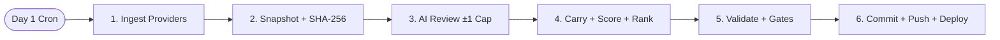

<div align="center">

# FINENESS

**Monthly Register Scoring Tokenized Asset Venues 0–1000 on What Actually Backs the Token**

🌐 **Web Application:** [https://fineness.tech](https://fineness.tech) · 🏆 **Latest Edition:** [https://fineness.tech/editions/2026-10](https://fineness.tech/editions/2026-10) · 🤖 **Machine JSON:** [https://fineness.tech/editions/2026-10.json](https://fineness.tech/editions/2026-10.json) · 📜 **Methodology:** [https://fineness.tech/method](https://fineness.tech/method) · 🐦 **X (Twitter):** [https://x.com/finenesslabs](https://x.com/finenesslabs)

*Most venues marketed as real-world-asset platforms launch memecoins — the real asset appears only as the pairing asset. Fineness measures that gap and prices it as purity.*

[](#-tech-stack)
[](#-scoring-engine)
[](#-monthly-pipeline-architecture)
[](#-testing--verification)
[](#-platform-interfaces)

</div>

---

## ⚡ Overview

**Fineness** publishes a monthly ranked register of venues that launch or trade tokenized assets. Each venue receives a **fineness score** from 0 to 1000, derived from five weighted criteria. A build-time pipeline pulls public figures into hashed snapshots and freezes permanent edition pages plus verbatim machine JSON.

The methodology is the product: every score is reproducible by a reader from published inputs. If a number cannot be traced to a source or a stated editorial judgement, it does not ship.

---

## 🏛️ Core Value Proposition

* **Deterministic Scoring:** Weighted mean × 100, rounded once. Same inputs, same output — recompute it in the browser.
* **Shareable Disagreement:** Reader weights serialize into `?w=` URLs with live re-sort and before-first-paint ranking. Post your link, argue with numbers.
* **Frozen Editions:** SHA-256 snapshot hashes, alphabetical tiebreaks, house-weight deltas, struck dates, dual-signed correction notes. Published editions never change silently.
* **Integrity by Construction:** No paid placement code path; every figure carries a resolving `sourceId`; missing metrics render as `not published`, never zero. Never described as an audit or rating.
* **Full Autonomy:** Monthly cron + AI review inside policy caps + gates; `--strict` halts on any smell. Zero hands on clean months.

---

## 🔬 Monthly Pipeline Architecture



### End-to-End Pipeline Stages

1. **Stage 1 — Ingest:**
   - Bitquery contract volume, DefiLlama fees/TVL, explorer verification.
   - Fresh nulls never clobber published figures; atomic snapshot writes.
2. **Stage 2 — AI Review:**
   - OpenAI-compatible analyst proposes moves inside ±1 with rewritten rationale.
   - Code disposes: integer clamp, known ids only, no credentials/garbage → carry unchanged.
3. **Stage 3 — Carry & Score:**
   - Judgement carried forward; fineness recomputed at house weights; ranks, bands, deltas embedded; struck dates recorded.
4. **Stage 4 — Gates & Ship:**
   - `validateEdition` hard-fails; `warnScoreMoves` + `checkAdmission` + `scopeNote` warn (`--strict` halts); tests + tsc + lint + build green; commit + push; Vercel deploys.

---

## 🖥️ Platform Interfaces

### 1. Landing Register (`app/page.tsx`)
- Hero proof bar (snapshot hash, peak), telemetry strip, venue ticker, ranked register with live reweighting, comparison + regulated tables, struck list, sources, footer archive.

### 2. Permanent Editions (`app/editions/[edition]/`)
- One frozen page per month + verbatim `.json` route. Unknown editions 404.

### 3. Venue Dossiers (`app/venues/[id]/`)
- Cross-edition fineness sparkline, current scores with rationale, pairing record, metrics, contracts with copy. Plus a `/venues` index.

### 4. Methodology (`app/method/`)
- Standing scoring weights, karat bands, admission standard, integrity constraints. Mirrors `docs/METHOD.md`.

### 5. Editorial Desk (`app/desk/`, internal, noindex)
- Runbook checklist, score-move review queue with approve toggles, admission findings, two-reviewer sign-off commit generator. Unlinked from navigation.

---

## 📁 Repository Structure

```text
fineness/
├── app/                           # Next.js 16 App Router pages
│   ├── page.tsx                   # Latest edition (canonical)
│   ├── editions/[edition]/        # Frozen page + edition.json route
│   ├── method/                    # Standing methodology
│   ├── venues/                    # Index + per-venue dossiers
│   ├── desk/                      # Internal editorial desk (noindex)
│   ├── layout.tsx                 # Fonts, preloader, metadata
│   └── globals.css                # Light editorial theme + motion
│
├── data/                          # Frozen, content-addressed
│   ├── editions/2026-09.json      # Genesis edition (peak 720)
│   ├── editions/2026-10.json      # Edition 02 (peak 745, Pons leads)
│   ├── snapshots/                 # Raw ingest output, hashed in headers
│   └── sources.json               # 20-entry sourceId registry
│
├── src/
│   ├── scoring/fineness.ts        # fineness(), band(), normalise()
│   ├── ingest/                    # bitquery, defillama, explorer, http, run
│   ├── build/                     # edition, carry, deltas, validate, admission, score-moves
│   ├── llm/                       # OpenAI-compatible client + guarded review
│   ├── site/                      # editions loader, weight-url, EditionView, components
│   └── types.ts                   # Venue, Edition, Snapshot, corrections
│
├── scripts/                       # monthly.ts (hands-free run), e2e.mjs (prod checks)
├── tests/                         # acceptance + per-edition + generic edition gates
├── docs/                          # brief, method, runbook, policies, reports
└── .github/workflows/monthly.yml  # Day-1 cron + manual dispatch
```

---

## 🛠️ Tech Stack

- **Framework:** Next.js 16.3 (App Router) + React 19 + TypeScript (Strict)
- **Styling:** Tailwind CSS v4 + framer-motion + Lucide icons
- **Data:** Bitquery + DefiLlama + chain explorer (monthly, null-safe)
- **AI Review:** OpenAI-compatible endpoint, temp 0, policy-clamped
- **Testing:** Vitest 4.x (74 tests, 14 files)

---

## 🚀 Quickstart & Local Development

### Prerequisites

- **Node.js**: `v20.x` or `v22.x` (LTS recommended)

### 1. Clone & Install Dependencies

```bash
git clone https://github.com/fineness-hq/fineness.git
cd fineness
npm install
```

### 2. Configure Environment Variables (all optional)

```bash
cp .env.example .env.local
```

Populate in `.env.local` (never commit):

```env
# AI Review (OpenAI-compatible endpoint; absent = carry scores unchanged)
LLM_API_URL="https://..."
LLM_API_KEY="your-server-llm-key"
LLM_MODEL="your-model"

# Ingest (absent = lookups stay null by design)
BITQUERY_API_KEY="your-bitquery-key"
```

### 3. Run Development Server

```bash
npm run dev
```

Open [http://localhost:3000](http://localhost:3000) in your browser.

### 4. Run a Monthly Edition (dry angles)

```bash
npm run monthly -- --edition=<YYYY-MM> --as-of=<YYYY-MM-DD> --published=<YYYY-MM-DD>
```

---

## 🧪 Testing & Verification

```bash
# Full Vitest test suite
npm test

# Strict TypeScript typechecking
npx tsc --noEmit

# ESLint audit (0 errors required)
npm run lint

# Production compilation
npm run build

# Live production route checks (requires build first)
npm run e2e
```

---

## 🛡️ Editorial Integrity & Risk Disclosures

* **Zero Paid Placement:** No venue pays for inclusion, placement, or removal. No such code path exists.
* **Null Discipline:** Missing metrics render as `not published`, never zero.
* **Immutable Editions:** Corrections ship as dated, dual-signed notes; original figures stay visible.
* **Secrets:** `.env.local` git-ignored; LLM + provider keys live in environment/CI secrets only.
* **Disclaimer:** Scores are editorial judgements on public information. Fineness is not an audit, a credit rating, or investment advice. Always conduct independent research.
